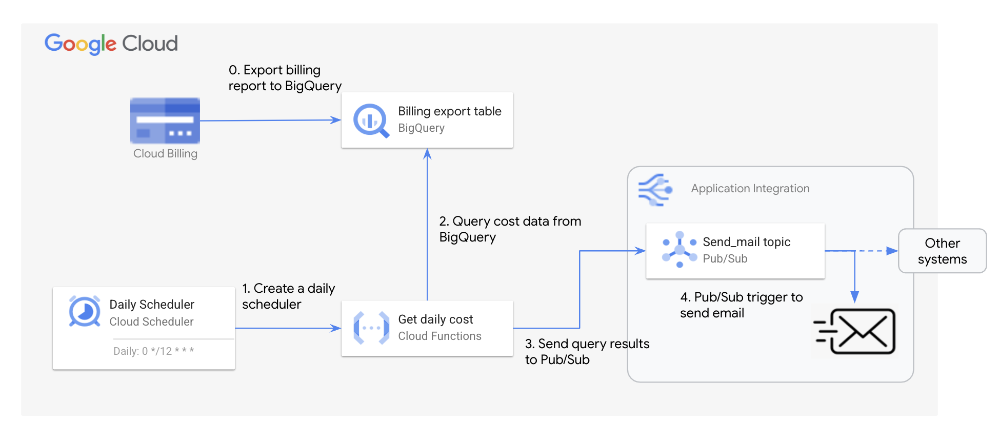

# Send daily cost through email

**用于将某个 GCP 项目的日用量，通过 Email 每日发送给相关人员，具体包括：**
 - 该项目每日的总花销
 - 成本 Top 10 的服务及费用
 - Top 10 服务费用的占比



> [!NOTE]  
> 架构里 Application Integration 是一项 GCP 可以原生支持发送通知邮件的服务，可替换为企业自己的邮箱服务.

## Deployment
### 0. Prerequisite 
首先需要在 Billing 控制台里，先确定 Billing export 已启用，Detail usage cost 导出到 BigQuery


### 1. 创建用于接收每日成本数据的 Pub/Sub topic，如果有多个email收件地址，则每个收件地址对应一个 Topic
```
topic_name="send-daily-cost"
gcloud pubsub topics create $topic_name
```

### 2. 创建用于查询数据的 Cloud Function，注意需要设置对应的环境变量，包括：
 - cost_table_name: BigQuery 中存放 detailed usage cost 的表名，格式为 ```project_id.dataset_name.table_name```


```
REGION="us-central1"
project_id=$(gcloud config get-value project)

topic_path=$(gcloud pubsub topics describe $topic_name --format="value(name)")


dataset="cost"  # 按照实际情况替换cost dataset name
table=$(gcloud alpha bq tables list --dataset=$dataset --filter="TABLE_ID ~ ^gcp_billing_export" --format="value(TABLE_ID)")
cost_table_name=$project_id"."$dataset"."$table


gcloud functions deploy get-daily-cost \
--gen2 \
--runtime=python311 \
--region=$REGION \
--source=. \
--entry-point=get_daily_cost \
--set-env-vars cost_table_name=$cost_table_name \
--trigger-http 
```

如果不需要通过 Application Integration 发送邮件，而是直接获取查询的结果数据，也可以直接调用改 Cloud Function 的 HTTP endpoint

> [!NOTE]  
> Cloud Function 将作为标准 API 对外发布，通过 HTTP Request 中的 header 信息，来指定获取哪些项目的每日费用，以及需要将费用统计发送到哪个 Pub/Sub topic

HTTP header 定义包括：
 - Project-IDs: 需要获取哪些项目的成本统计，用逗号隔开
 - Topic-Name: 用于接收成本数据，并推送邮件的 Pub/Sub topic，格式为 ```projects/project_id/topics/topic_name```
```
curl -m 70 -X GET https://us-central1-hxh-demo.cloudfunctions.net/get-daily-cost \
-H "Authorization: bearer $(gcloud auth print-identity-token)" \
-H "Content-Type: application/json" \
-H "Project-IDs: hxh-demo" \
-H "Topic-Name: projects/hxh-demo/topics/test"
```

查询结果返回如下：
```
[
    {
        "date": "11/15/2023",
        "project": "hxh-demo",
        "top10_service":
        [
            {
                "cost": 6.12,
                "cost_ratio": 0.558,
                "service": "Networking"
            },
            {
                "cost": 3.08,
                "cost_ratio": 0.2805,
                "service": "Compute Engine"
            },
            {
                "cost": 1.49,
                "cost_ratio": 0.1358,
                "service": "Kubernetes Engine"
            },
            {
                "cost": 0.15,
                "cost_ratio": 0.0132,
                "service": "Security Command Center"
            },
            {
                "cost": 0.13,
                "cost_ratio": 0.0121,
                "service": "Notebooks"
            },
            {
                "cost": 0.0,
                "cost_ratio": 0.0,
                "service": "Artifact Registry"
            },
            {
                "cost": 0.0,
                "cost_ratio": 0.0,
                "service": "Vertex AI"
            }
        ],
        "total_cost": 10.96
    },
    {
        "date": "11/15/2023",
        "project": "hxh-genai4",
        "top10_service":
        [
            {
                "cost": 90.29,
                "cost_ratio": 0.7148,
                "service": "Vertex AI Vision"
            },
            {
                "cost": 36.0,
                "cost_ratio": 0.2849,
                "service": "Vertex AI"
            },
            {
                "cost": 0.02,
                "cost_ratio": 0.0001,
                "service": "Artifact Registry"
            }
        ],
        "total_cost": 126.31
    }
]
```


### 3. 创建一个 Daily 触发的 Cloud Scheduler，目标为 Cloud Function HTTP endpoint
 - Frequency: ```0 10 * * *```
 - Authentication: 选择一个具有 Cloud Function Invoker 权限的 Service Account
 - HTTP header 添加
   - **Project-IDs:** id1,id2,id3
   - **(Optional)Topic-Name:** projects/project_id/topics/topic_name


> [!NOTE]  
> Cost usage report 导出到 BigQuery 大概会有 6 个小时左右的延迟，所以上午10点钟，可汇总计算前一天的总费用，但与 Cost Report 控制台中的费用可能会有少许差别

### 4. 创建 Application Integration，用于发送通知邮件
在 Send Email 任务中，指定邮件的主题，发送对象，邮件正文选择 Pub/Sub 的 Message Data


### 邮件示例
